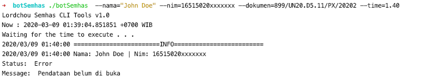

# Bot Semhas Skripsi

This bot write in Go Programming Language. This binary will help you especially for old semester Brawijaya Computer Science University, to schedule when to register result seminar of thesis  

Download binary in Release page

How To Run
```cassandraql
$ chmod 755 ./botSemhas
$ ./botSemhas --nama=<Nama> --nim=<Nim> --dokument=<nomerDokumentSemhas> --time=<waktuPendaftaran>

Usage of ./botSemhas:
  -dokumen string
        Nomor Dokumen undangan semhas 
        Contoh: 279/UN10.F15.11/PP/2020
  -help
        prints usage of Lordchou Semhas Bot
  -nama string
        Nama mahasiswa 
        Contoh: John Doe
  -nim string
        Nomer Induk Mahasiswa 
        Contoh: 16515020xxxxxxx
  -time string
        Waktu embukaan audiensi semhas
        Contoh: 15.00
  -version
        prints current Lordchou Semhas Bot Version
```

Example

``` 
$ ./botSemhas  --nama="John Doe" --nim=16515020xxxxxxx --dokumen=899/UN20.D5.11/PX/20202 --time=1.40
```

Output Example

